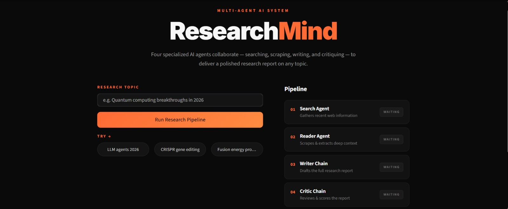

# 🔍 Multi-Agent AI Research System

An AI-powered research assistant built using **LangChain**, **Google Gemini**, **Tavily Search API**, and **BeautifulSoup**. The system leverages a multi-agent architecture to automate web research, content extraction, report generation, and quality review.

---

## 📸 Project Preview

<p align="center">
  
</p>

---

## 🚀 Features

- 🔎 AI-Powered Web Research
- 🤖 Multi-Agent Architecture
- 🌐 Real-Time Web Search using Tavily
- 📄 Content Extraction with BeautifulSoup
- ✍️ Automated Research Report Generation
- 🧠 AI-Based Report Review & Critique
- 🎨 Streamlit User Interface
- ⚡ Modular & Scalable Design

---

## 🏗️ System Architecture

```text
User Query
    │
    ▼
┌─────────────────┐
│ Search Agent    │
│ (Tavily Search) │
└────────┬────────┘
         │
         ▼
┌─────────────────┐
│ Reader Agent    │
│ (BeautifulSoup) │
└────────┬────────┘
         │
         ▼
┌─────────────────┐
│ Writer Chain    │
│ (Gemini LLM)    │
└────────┬────────┘
         │
         ▼
┌─────────────────┐
│ Critic Chain    │
│ (Review Agent)  │
└────────┬────────┘
         │
         ▼
     Final Report
```

---

## 🛠️ Tech Stack

### AI & LLM Frameworks

- LangChain
- Google Gemini API

### Search & Data Collection

- Tavily Search API
- BeautifulSoup4
- Requests

### Frontend

- Streamlit

### Backend

- Python

---

## 📂 Project Structure

```text
Multi-Agent-AI-Research-System/
│
├── screenshots/
│   └── homepage.jpeg
│
├── agents.py
├── tools.py
├── pipeline.py
├── app.py
├── requirements.txt
├── .env.example
├── .gitignore
└── README.md
```

### Processing Pipeline

1. Search Agent performs web research using Tavily Search.
2. Reader Agent extracts content from discovered URLs.
3. Writer Chain generates a structured research report.
4. Critic Chain reviews and improves the report.
5. Final report is displayed to the user.

---

## 🎯 Learning Outcomes

This project demonstrates:

- Agentic AI Systems
- Multi-Agent Architectures
- LangChain Framework
- Tool Calling
- Prompt Engineering
- Web Search Integration
- Web Scraping
- LLM Workflow Orchestration
- Research Automation

---

## 📈 Future Improvements

- Memory-Enabled Agents
- Agent Collaboration & Planning
- Research Citation Generation
- PDF Report Export
- Multi-Model Support
- RAG Integration with Vector Databases
- Cloud Deployment

---

## 👨‍💻 Author

### Vruddhi Zaveri

B.Tech in Artificial Intelligence & Machine Learning

- AI/ML Engineer
- GenAI Enthusiast

GitHub: https://github.com/vruddhiZaveri

---

## ⭐ Support

If you found this project useful, consider giving it a ⭐ on GitHub!

It helps others discover the project and motivates further development.
